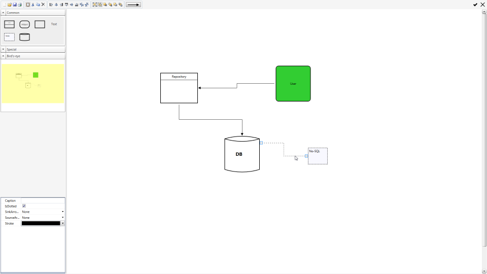

Plainion.Whiteboard aims to be a pragmatic design tool for whiteboard like design sessions.

## Installation

Just download [latest release](https://github.com/plainionist/Plainion.Whiteboard/releases),
unpack whereever you want and start the executable.

## Usage

Just start dragging shapes from the toolbox and the rest is hopefully intuitively usable :)

